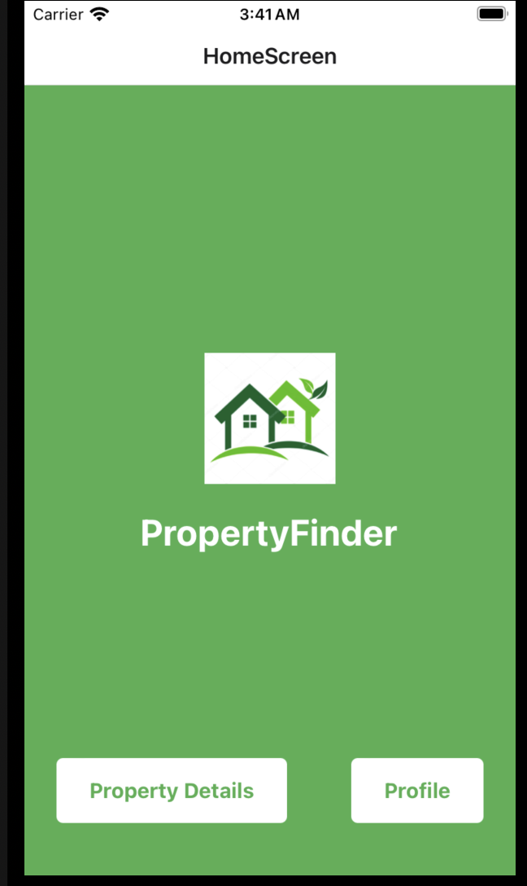
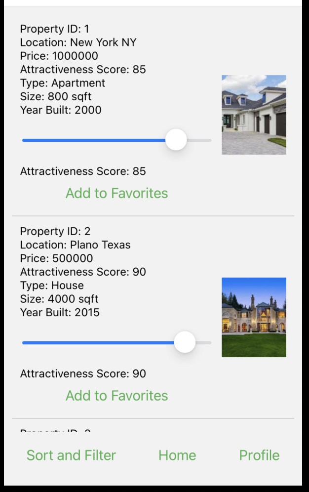
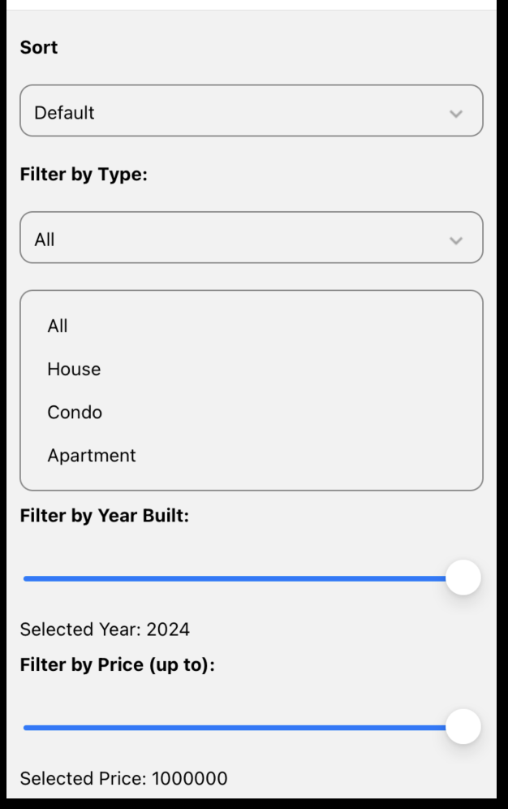
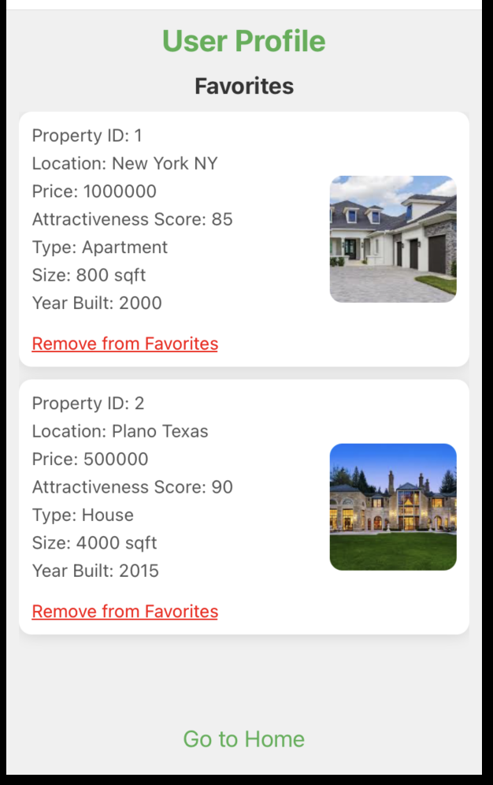

# PropertyFinder

PropertyFinder is a React Native app and website that allows users to view property details, filter and sort properties, and manage a list of favorite properties.

## Features

- View detailed property information
- Filter and sort properties
- Add properties to a favorites list
- Adjust the attractiveness score of properties using a slider
- Responsive design for both mobile app and website

## Screenshots

### Home Screen


### Property Details Screen


### Filter and Sort Screen


### Profile Screen


## Installation

### Prerequisites

- Node.js
- npm (Node Package Manager)
- Expo CLI (for React Native)

### For the React Native App

1. Clone the repository:
    ```sh
    git clone https://github.com/yourusername/PropertyFinder.git
    cd PropertyFinder/MyApp
    ```

2. Install dependencies:
    ```sh
    npm install
    ```

3. Start the development server:
    ```sh
    npm start
    ```

### For the Website

1. Navigate to the `property-finder` directory:
    ```sh
    cd PropertyFinder/property-finder
    ```

2. Install dependencies:
    ```sh
    npm install
    ```

3. Start the development server:
    ```sh
    npm start
    ```

## Usage

### Running the App

- For the React Native app, scan the QR code generated by Expo using the Expo Go app on your mobile device.
- For the website, open a browser and go to `http://localhost:3000`.

## Steps to Deploy Assignment Online

To deploy the website online for easy testing, you can use platforms like Vercel, Netlify, or GitHub Pages. Here's a quick guide for Vercel:

1. Install Vercel CLI:
    ```sh
    npm install -g vercel
    ```

2. Deploy the website:
    ```sh
    cd PropertyFinder/property-finder
    vercel
    ```

Follow the prompts to deploy your website. Once deployed, you will receive a URL to access your site online.

## Design Choices

- **UI/UX Design**: The app and website feature a clean and simple UI, with a consistent color scheme and easy navigation.
- **Data Management**: JSON files are used for storing property data, which makes it easy to update and manage.
- **Responsive Design**: Both the app and the website are designed to be responsive, ensuring a good user experience on different devices and screen sizes.

## Limitations

- **Data Persistence**: Currently, favorites and changes to attractiveness scores are not persisted between sessions.
- **Scalability**: The app uses static JSON files for data storage, which may not be suitable for a large number of properties.

## Ideas for Improvement

- **Data Persistence**: Implement local storage or a backend database to persist favorites and other user data.
- **Advanced Filtering**: Add more advanced filtering options and improve the sorting functionality.
- **User Authentication**: Add user authentication to save user preferences and data across devices.
- **Improved UI/UX**: Further improve the user interface and experience, including animations and transitions.

## How You Would Approach It Differently with More Time/Resources

- **Backend Integration**: Integrate a backend service to handle data storage, user authentication, and more advanced features.
- **Real-Time Updates**: Implement real-time updates for property data and user actions using WebSockets or similar technologies.
- **Testing**: Add comprehensive unit and integration tests to ensure the app's reliability and performance.

## Other Important Thoughts

- **Performance**: Consider optimizing performance for both the app and the website, especially when handling a large number of properties.
- **Accessibility**: Ensure the app and website are accessible to all users, including those with disabilities, by following best practices for accessibility.
- **Security**: Pay attention to security aspects, especially when dealing with user data and authentication.

## License

This project is licensed under the MIT License - see the [LICENSE](LICENSE) file for details.
